# Practica 1 - SOLID, Estrategia y Análisis de un algoritmo

- Universidad de La Laguna
- Grado en Ingeniería Informática
- Diseño y Análisis de Algoritmos
- Autor: Adal Díaz Fariña
- Contacto: alu0101112251@ull.edu.es

# Informe

## **1. ¿En qué consisten estos principios? ¿En qué consiste el principio de responsabilidad única?**

Los principios SOLID son una serie de reglas o directrices a seguir para mejorar el diseño orientado a objetos. Existen 5 principios SOLID:

1. **Principio de la responsabilidad única: "Nunca debe haber una razón para cambiar una clase". - Robert Martin.**

El principio de la responsabilidad única lo podemos traducir como cada clase debe hacer una única tarea. Es decir, una clase debe tener una sola responsabilidad. Por ejemplo: si tenemos una clase de números complejos, esta clase debe ser capaz de representar números complejos, de realizar operaciones con números complejos, etc. Su responsabilidad es la de poder tratar con números complejos. Cualquier método que no tenga que ver con los números complejos queda excento de estar en esta clase.

2. **Principio abierto cerrado: "Las entidades de software (clases, módulos, funciones, etc.) deben estar abiertas para la extensión, pero cerradas para la modificación". — Robert Martin parafraseando a Bertrand Meyer.**

La idea principal de este principio es que no hay necesidad de modificar una clase que ya hemos creado, si necesitamos hacer uso de esa clase modificando algunos métodos podemos hacer uso de técnicas orientadas a objetos como la herencia y la composición para modificarla o aumentarla.

3. **Principio de sustitución de Liskov: "Las funciones que usan punteros o referencias a clases base deben poder usar objetos de clases derivadas sin saberlo". — Robert Martin**

El principio de sustitución de Liskov nos indica que deberíamos poder sustituir la instancia de una subclase por la clase principal y todo debería seguir funcionando correctamente.

4. **Principio de segregación de interfaz: "Los clientes no deben verse obligados a depender de interfaces que no utilizan". — Robert Martin**

Hay que mantener las interfeces pequeñas y cohesivas. Esto es debido a que si una interfaz es muy amplia, se está poniendo una enorme carga de implementación en cualquiera que quiera adherirse a ese contrato. Ejemplo: "cuando un cliente depende de una clase que contiene interfaces que el cliente no usa, pero que otros clientes sí usan, entonces ese cliente se verá afectado por los cambios que esos otros clientes fuerzan en la clase"

5. **Principio de inversión de dependencia:**
- **A. Los módulos de alto nivel no deben depender de los módulos de bajo nivel. Ambos deben depender de las abstracciones.**
- **B. Las abstracciones no deben depender de los detalles. Los detalles deben depender de las abstracciones". — Robert Martin**

Básicamente lo que nos dice este principio es que si una clase tiene dependencias de otra clase, debe basarse en las interfaces de las dependecias en vez de sus tipos concretos. La idea es que nuestra clase dependa de abstracciones. Así si todos los detalles de nuestras abstracciones cambian, nuestra clase seguirá estando a salvo.

## **2. Repaso del concepto de Polimorfismo**

1. **Ejemplo polimorfismo 0**

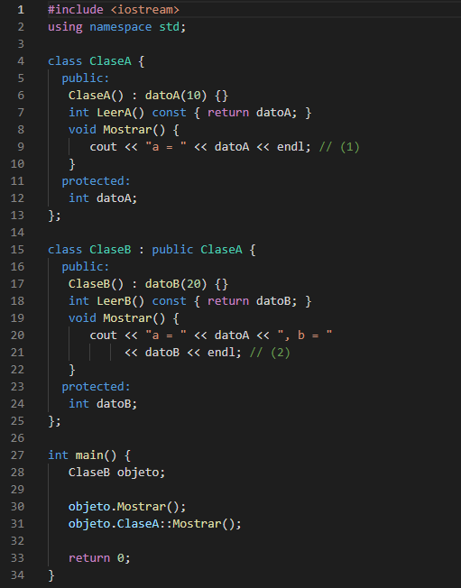

Como podemos ver en la imagen en este ejemplo tenemos dos clases: Una clase base o padre que es la clase A y una clase hija o derivada que es la clase B. Como podemos ver en el main en la línea 28, se define un objeto de la clase B y luego en la línea 30 se llama al método mostrar por lo que esperamos como resultado a = 10, b = 20. Esto es debido a que estamos llamando al método mostrar de la clase B. En la linea acontinuación se vuelve a llamar al método mostrar pero haciendo uso del polimorfismo esta vez se llama al método mostrar de la clase A y el resultado que esperamos es a = 10. En la primera llamada al método mostrar sabemos que a es igual 10 porque así se declara en la clase padre (la clase A) y al ser una atributo de tipo protected se hereda como un atributo privado en la clase hija (la clase B).

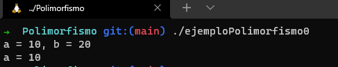

2. **Ejemplo polimorfismo 1**

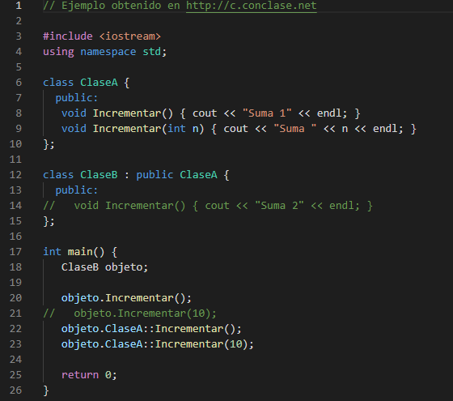

En este ejemplo, da igual que estemos usando un objeto de la clase A o la clase B. Al la clase B no tener implementado estos métodos va a utilizar los de la clase padre (la clase A), por lo que los resultados esperados son: Suma 1, Suma 1, y Suma 10

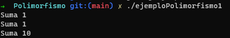

Si descomentamos las lineas de código de la linea 14 ahora cuando objeto llama a icrementar sin aplicar el polimorfismo llamamos al incrementar de la clase B.

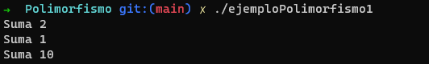

Lo interesante ocurre cuando descomentamos la línea 21. Cuando descomentamos la línea 21 nos devolverá un error esto es debido a que no se puede acceder a las funciones superpuestas de la clase padre, aunque tengan diferentes número de parámetros

3. **Ejemplo polimorfismo 2**

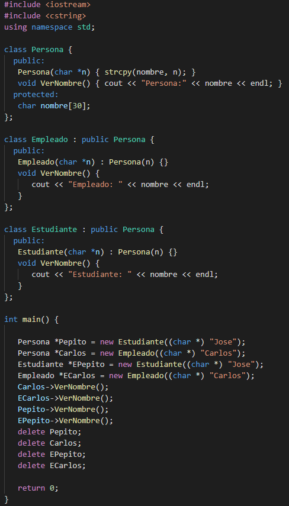

Como podemos ver en la imagen tenemos cuatro punteros y a través de esos punteros estamos llamando a los métodos VerNombre. Lo curioso es que auque digamos que Pepito es un nuevo estudiante al puntero ser de tipo Persona, cuando llamamos al método VerNombre se esta llamando al del Persona y no al de estudiante. Es decir se ejecuta el método VerNombre que se definio a la clase base. Entonces la salida es la correspondiente:

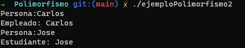

4. **Ejemplo polimorfismo 3**

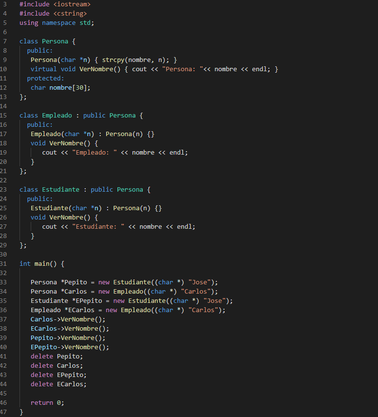

Si comparamos el ejemplo anterior con el actual es el mismo menos que en la línea 10 le añadimos virtual delante. Gracias al virtual nos da un resultado totalmente diferente. Lo interesante cuando defeniamos antes a Pepito como un estudiante y llamabamos al método VerNombre era que llamará al método de la clase hija estudiante pero no era así. Ahora con virtual en vez de llamar al método de la clase padre llamamos al método de la clase hija por lo que el resultado nos queda así:

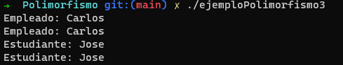

5. **Ejemplo polimorfismo 4**

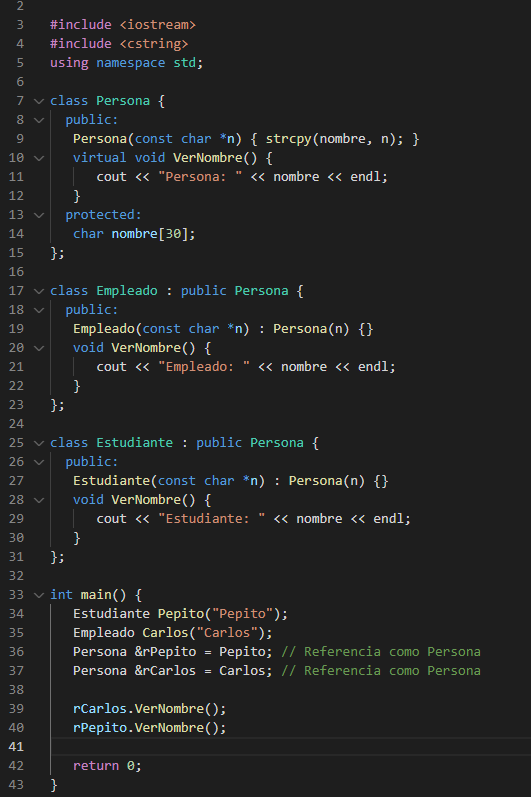

En este caso funciona igual que el caso anterior pero con referencias. Como sigue siendo un método virtual VerNombre, lo seguirá siendo en las clase heredadas así que la solución será la siguiente: 

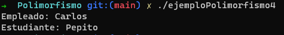

## **3. Patrón estrategia**

## **4. Análisis de algoritmos**

Utiliza el patrón estrategia (sin usar templates) para implementar dos versiones del producto de matrices:

- Versión que realiza el producto de matrices recorriendo la matriz por filas.
- Versión que realiza el producto de matrices recorriendo la matriz por columnas.

El programa debe tener la capacidad de generar instancias aleatorias de diferentes tamaños, de tal forma que sirvan como entrada a los algoritmos creados. Analiza el tiempo de ejecución variando el tamaño de las matrices a multiplicar, intentando extraer conclusiones sobre el comportamiento en el límite. Se debe apreciar una diferencia a nivel computacional entre versiones.
