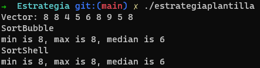
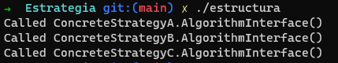
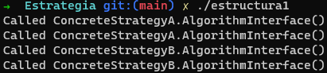
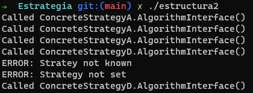

# Practica 1 - SOLID, Estrategia y Análisis de un algoritmo

- Universidad de La Laguna
- Grado en Ingeniería Informática
- Diseño y Análisis de Algoritmos
- Autor: Adal Díaz Fariña
- Contacto: alu0101112251@ull.edu.es

# Informe

## **1. ¿En qué consisten estos principios? ¿En qué consiste el principio de responsabilidad única?**

Los principios SOLID son una serie de reglas o directrices a seguir para mejorar el diseño orientado a objetos. Existen 5 principios SOLID:

###  **1. Principio de la responsabilidad única: "Nunca debe haber una razón para cambiar una clase". - Robert Martin.**

El principio de la responsabilidad única lo podemos traducir como cada clase debe hacer una única tarea. Es decir, una clase debe tener una sola responsabilidad. Por ejemplo: si tenemos una clase de números complejos, esta clase debe ser capaz de representar números complejos, de realizar operaciones con números complejos, etc. Su responsabilidad es la de poder tratar con números complejos. Cualquier método que no tenga que ver con los números complejos queda excento de estar en esta clase.

###  **2. Principio abierto cerrado: "Las entidades de software (clases, módulos, funciones, etc.) deben estar abiertas para la extensión, pero cerradas para la modificación". — Robert Martin parafraseando a Bertrand Meyer.**

La idea principal de este principio es que no hay necesidad de modificar una clase que ya hemos creado, si necesitamos hacer uso de esa clase modificando algunos métodos podemos hacer uso de técnicas orientadas a objetos como la herencia y la composición para modificarla o aumentarla.

###  **3. Principio de sustitución de Liskov: "Las funciones que usan punteros o referencias a clases base deben poder usar objetos de clases derivadas sin saberlo". — Robert Martin**

El principio de sustitución de Liskov nos indica que deberíamos poder sustituir la instancia de una subclase por la clase principal y todo debería seguir funcionando correctamente.

###  **4. Principio de segregación de interfaz: "Los clientes no deben verse obligados a depender de interfaces que no utilizan". — Robert Martin**

Hay que mantener las interfeces pequeñas y cohesivas. Esto es debido a que si una interfaz es muy amplia, se está poniendo una enorme carga de implementación en cualquiera que quiera adherirse a ese contrato. Ejemplo: "cuando un cliente depende de una clase que contiene interfaces que el cliente no usa, pero que otros clientes sí usan, entonces ese cliente se verá afectado por los cambios que esos otros clientes fuerzan en la clase"

###  **5. Principio de inversión de dependencia:**
- **A. Los módulos de alto nivel no deben depender de los módulos de bajo nivel. Ambos deben depender de las abstracciones.**
- **B. Las abstracciones no deben depender de los detalles. Los detalles deben depender de las abstracciones". — Robert Martin**

Básicamente lo que nos dice este principio es que si una clase tiene dependencias de otra clase, debe basarse en las interfaces de las dependecias en vez de sus tipos concretos. La idea es que nuestra clase dependa de abstracciones. Así si todos los detalles de nuestras abstracciones cambian, nuestra clase seguirá estando a salvo.

## **2. Repaso del concepto de Polimorfismo**

En este apartado vamos a repasar sobre Polimorfismo comentado los ejemplos que nos han facilitado en la asignatura.

1. **Ejemplo polimorfismo 0**


Como podemos ver en la imagen en este ejemplo tenemos dos clases: Una clase base o padre que es la clase A y una clase hija o derivada que es la clase B. Como podemos ver en el main en la línea 28, se define un objeto de la clase B y luego en la línea 30 se llama al método mostrar por lo que esperamos como resultado a = 10, b = 20. Esto es debido a que estamos llamando al método mostrar de la clase B. En la linea acontinuación se vuelve a llamar al método mostrar pero haciendo uso del polimorfismo esta vez se llama al método mostrar de la clase A y el resultado que esperamos es a = 10. En la primera llamada al método mostrar sabemos que a es igual 10 porque así se declara en la clase padre (la clase A) y al ser una atributo de tipo protected se hereda como un atributo privado en la clase hija (la clase B).


2. **Ejemplo polimorfismo 1**


En este ejemplo, da igual que estemos usando un objeto de la clase A o la clase B. Al la clase B no tener implementado estos métodos va a utilizar los de la clase padre (la clase A), por lo que los resultados esperados son: Suma 1, Suma 1, y Suma 10


Si descomentamos las lineas de código de la linea 14 ahora cuando objeto llama a icrementar sin aplicar el polimorfismo llamamos al incrementar de la clase B.


Lo interesante ocurre cuando descomentamos la línea 21. Cuando descomentamos la línea 21 nos devolverá un error esto es debido a que no se puede acceder a las funciones superpuestas de la clase padre, aunque tengan diferentes número de parámetros

3. **Ejemplo polimorfismo 2**


Como podemos ver en la imagen tenemos cuatro punteros y a través de esos punteros estamos llamando a los métodos VerNombre. Lo curioso es que auque digamos que Pepito es un nuevo estudiante al puntero ser de tipo Persona, cuando llamamos al método VerNombre se esta llamando al del Persona y no al de estudiante. Es decir se ejecuta el método VerNombre que se definio a la clase base. Entonces la salida es la correspondiente:


4. **Ejemplo polimorfismo 3**


Si comparamos el ejemplo anterior con el actual es el mismo menos que en la línea 10 le añadimos virtual delante. Gracias al virtual nos da un resultado totalmente diferente. Lo interesante cuando defeniamos antes a Pepito como un estudiante y llamabamos al método VerNombre era que llamará al método de la clase hija estudiante pero no era así. Ahora con virtual en vez de llamar al método de la clase padre llamamos al método de la clase hija por lo que el resultado nos queda así:


5. **Ejemplo polimorfismo 4**


En este caso funciona igual que el caso anterior pero con referencias. Como sigue siendo un método virtual VerNombre, lo seguirá siendo en las clase heredadas así que la solución será la siguiente: 


## **3. Patrón estrategia**

En este apartado vamos a repasar los patrones de estrategia utilizando los ejemplos que nos han facilitado en la asignatura.

1. **Ejemplo estrategia plantilla**

``` c++
#include <iostream>
#include <cstdlib>
#include <ctime>
using namespace std;

class SortBubble {
public:
   void sort( int v[], int n ) {
	cout << "SortBubble" << endl;
   }
};

class SortShell {
public:
   void sort( int v[], int n ) {
	cout << "SortShell" << endl;
   }
};

template<class STRATEGY>
class Stat {
public:
   void readVector( int v[], int n ) {
      imp_.sort( v, n );
      min_ = v[0];   max_ = v[n-1];
      med_ = v[n/2]; 
   }
   int getMin() { return min_; }
   int getMax() { return max_; }
   int getMed() { return med_; }
private:
   int       min_, max_, med_;
   STRATEGY  imp_;
};

int main( void ) {
   const int NUM = 9;
   int       array[NUM];
   time_t    t;
   srand((unsigned) time(&t));
   cout << "Vector: ";
   for (int i=0; i < NUM; i++) {
      array[i] = rand() % 9 + 1;
      cout << array[i] << ' '; 
   }
   cout << endl;

   Stat<SortBubble>  obj;
   obj.readVector( array, NUM );
   cout << "min is " << obj.getMin()
      << ", max is " << obj.getMax()
   << ", median is " << obj.getMed()
      << endl;

   Stat<SortShell>  two;
   two.readVector( array, NUM );
   cout << "min is " << two.getMin()
      << ", max is " << two.getMax()
      << ", median is " << two.getMed()
      << endl;
};
```

Esta estrategia tiene 3 puntos claves. El primero sería la clase Stat que contiene que es lo que queremos hacer que en este caso es obtener el máximo, mínimo y el valor medio de un array. El otro sería que definimos una template para ver que estrategia utilizamos para ordenar el array en la clase Stat y por último nos encontramos con las clases SortBubble y SortShell que son las dos estrategias de ordenación que podemos utilizar en este ejemplo. Ese sería resumido lo que hace este patrón. A través de la template indicamos que estrategia vamos a utilizar para obtener lo que queremos con la clase Stat.



2. **Ejemplo estructura**

``` c++
// Strategy pattern -- Structural example

#include <iostream>
using namespace std;


// The 'Strategy' abstract class
class Strategy {
    public: 
	virtual void AlgorithmInterface() = 0;
 };


// A 'ConcreteStrategy' class
class ConcreteStrategyA : public Strategy  {
    void AlgorithmInterface() {
     cout <<  "Called ConcreteStrategyA.AlgorithmInterface()" << endl;
    }
};

 
// A 'ConcreteStrategy' class
class ConcreteStrategyB : public Strategy  {
    void AlgorithmInterface() {
     cout <<  "Called ConcreteStrategyB.AlgorithmInterface()" << endl;
    }
};

// A 'ConcreteStrategy' class
class ConcreteStrategyC : public Strategy  {
    void AlgorithmInterface() {
     cout <<  "Called ConcreteStrategyC.AlgorithmInterface()" << endl;
    }
};
 


// The 'Context' class
class Context {
    private:
	 Strategy *_strategy;
    public:
         // Constructor
         Context(Strategy *strategy) {
            _strategy = strategy;
         }
 
         void ContextInterface() {
            _strategy -> AlgorithmInterface();
         }

};

int main() {
      Context *context_a, *context_b, *context_c;

      // Three contexts following different strategies

      context_a = new Context(new ConcreteStrategyA());
      context_a->ContextInterface();

      context_b = new Context(new ConcreteStrategyB());
      context_b->ContextInterface();


      context_c = new Context(new ConcreteStrategyC());
      context_c->ContextInterface();

}
```

En esta estrategia tenemos 3 partes importantes. La primera sería el contexto que nos permite utilizar las diferentes funcionalidades que necesitamos sin conocer como funcionan por detrás. Es decir, nos abstrae de la lógica de la aplicación. Luego tenemos la clase Strategy que es el padre de todas las estrategias y por último tenemos a las diferentes clases hijas que componen el conjunto de estrategias disponibles. Es decir a través de la herencia podemos usar una misma clase cambiando la interfaz que queremos en cada caso. Usando context basta con definirle la extrategia que vamos a unitilizar y la clase context ya nos permite utilizar las funcionalidades que necesitamos.

El resultado de la ejecución es el siguiente:



3. **Ejemplo estructura 1**

```c++
// Strategy pattern -- Structural example

#include <iostream>
using namespace std;

enum TYPESTRATEGY{A, B, C};

// The 'Strategy' abstract class
class Strategy {
    public: 
	virtual void AlgorithmInterface() = 0;
 };


// A 'ConcreteStrategy' class
class ConcreteStrategyA : public Strategy  {
    void AlgorithmInterface() {
     cout <<  "Called ConcreteStrategyA.AlgorithmInterface()" << endl;
    }
};

 
// A 'ConcreteStrategy' class
class ConcreteStrategyB : public Strategy  {
    void AlgorithmInterface() {
     cout <<  "Called ConcreteStrategyB.AlgorithmInterface()" << endl;
    }
};

// A 'ConcreteStrategy' class
class ConcreteStrategyC : public Strategy  {
    void AlgorithmInterface() {
     cout <<  "Called ConcreteStrategyC.AlgorithmInterface()" << endl;
    }
};
 


// The 'Context' class
class Context {
    private:
	 Strategy *_strategy;
    public:
         // Constructor
         Context() {
            _strategy = NULL;
         }
         // Constructor
         Context(Strategy *strategy) {
            _strategy = strategy;
         }
 
         void setstrategy(TYPESTRATEGY type ) {
	    delete _strategy;
	    if (type == A)
            	_strategy = new ConcreteStrategyA();
	    else if (type == B)
            	_strategy = new ConcreteStrategyB();
	    else if (type == C)
            	_strategy = new ConcreteStrategyC();
	    else 
		cout << "ERROR: Stratey not known" << endl; 
         }

         void setstrategy(Strategy *strategy ) {
	    delete _strategy;
	    _strategy = strategy;
         }
         void ContextInterface() {
            _strategy -> AlgorithmInterface();
         }

};

int main() {
      Context *pcontext;
      Context context;

      pcontext = new Context(new ConcreteStrategyA());
      context.setstrategy(A);

      pcontext->ContextInterface();
      context.ContextInterface();

      pcontext -> setstrategy(new ConcreteStrategyB());
      context.setstrategy(B); 

      pcontext->ContextInterface();
      context.ContextInterface();

}
```

El ejemplo de estructura 1 es una continuación del ejemplo de estructura. Lo único que añade es que ahora podemos enumerar las estrategias. Como podemos ver en el main queda mucho más legible si enumeramos las estrategia. Pero la lógica es exactamente la misma.

El resultado de la ejecución es el siguiente:



4. **Ejemplo estructura 2**

```c++
// Strategy pattern -- Structural example

#include <iostream>
using namespace std;

enum TYPESTRATEGY{A, B, C, D};

// The 'Strategy' abstract class
class Strategy {
    public: 
	virtual void AlgorithmInterface() = 0;
 };


// A 'ConcreteStrategy' class
class ConcreteStrategyA : public Strategy  {
    void AlgorithmInterface() {
     cout <<  "Called ConcreteStrategyA.AlgorithmInterface()" << endl;
    }
};

 
// A 'ConcreteStrategy' class
class ConcreteStrategyB : public Strategy  {
    void AlgorithmInterface() {
     cout <<  "Called ConcreteStrategyB.AlgorithmInterface()" << endl;
    }
};

// A 'ConcreteStrategy' class
class ConcreteStrategyC : public Strategy  {
    void AlgorithmInterface() {
     cout <<  "Called ConcreteStrategyC.AlgorithmInterface()" << endl;
    }
};
 

// A new 'ConcreteStrategy' class
class ConcreteStrategyD : public Strategy  {
    void AlgorithmInterface() {
     cout <<  "Called ConcreteStrategyD.AlgorithmInterface()" << endl;
    }
};

// The 'Context' class
class Context {
    protected:
	 Strategy *_strategy;
    public:
         // Constructor
         Context() {
            _strategy = NULL;
         }
         // Constructor
         Context(Strategy *strategy) {
            _strategy = strategy;
         }

         void setstrategy(TYPESTRATEGY type ) {
	    delete _strategy;
	    if (type == A)
            	_strategy = new ConcreteStrategyA();
	    else if (type == B)
            	_strategy = new ConcreteStrategyB();
	    else if (type == C)
            	_strategy = new ConcreteStrategyC();
	    else { 
		cout << "ERROR: Stratey not known" << endl; 
		_strategy = NULL;
	    }
         }

         void setstrategy(Strategy *strategy ) {
	    delete _strategy;
	    _strategy = strategy;
         }
         void ContextInterface() {
	    if (_strategy)
            	_strategy -> AlgorithmInterface();
	    else
		cout << "ERROR: Strategy not set" << endl;
         }

};

// The 'Context' class
class Newcontext: public Context {
	public:
         void setstrategy(TYPESTRATEGY type ) {
	    delete _strategy;
	    if (type == D)
            	_strategy = new ConcreteStrategyD();
	    else 
		Context::setstrategy(type);
         }
};

int main() {
      Context *pcontext;
      Context context;
      Newcontext newcontext;

      pcontext = new Context(new ConcreteStrategyA());
      context.setstrategy(A);
      newcontext.setstrategy(A);

      pcontext->ContextInterface();
      context.ContextInterface();
      newcontext.ContextInterface();

      pcontext -> setstrategy(new ConcreteStrategyD());
      pcontext->ContextInterface();

      context.setstrategy(D); 
      context.ContextInterface();

      newcontext.setstrategy(D); 
      newcontext.ContextInterface();

}
```

En este último ejemplo disponemos de una última estrategia y formas de acceder a ella. Con el puntero no va a ver ningún problema, mientras el puntero a esa estrateguia exista va a funcionar. Con el objeto context depende. Al no estar todos los tipos definidos en context como es el caso de D, si decimos que la estrateguía va a ser la D va a fallar porque no contempla ese tipo. Para poder hacer uso de la estrateguia D necesitamos usar el puntero o el objeto newcontent que en la clase NewContent. Esta clase si contempla el tipo D aparte de los tres tipos previos de estrateguía que hemos visto.

El resultado de la ejecución es el siguiente:



## **4. Análisis de algoritmos**

Utiliza el patrón estrategia (sin usar templates) para implementar dos versiones del producto de matrices:

- Versión que realiza el producto de matrices recorriendo la matriz por filas.
- Versión que realiza el producto de matrices recorriendo la matriz por columnas.

El programa debe tener la capacidad de generar instancias aleatorias de diferentes tamaños, de tal forma que sirvan como entrada a los algoritmos creados. Analiza el tiempo de ejecución variando el tamaño de las matrices a multiplicar, intentando extraer conclusiones sobre el comportamiento en el límite. Se debe apreciar una diferencia a nivel computacional entre versiones.
